# MLOps Pipeline Diagram

This Mermaid diagram shows the full mini MLOps pipeline for the online transportation fare estimation learning simulation.

```mermaid
flowchart LR
    subgraph DataLayer["Data Layer"]
        A["Raw Data<br/>cab_rides.csv + weather.csv"]
        B["Data Audit"]
    end

    subgraph CIStage["CI Stage"]
        C["CI Data Validation"]
        D["Data Cleaning"]
        E["Feature Engineering"]
        F["Preprocessing Pipeline"]
    end

    subgraph CTStage["CT Stage"]
        G["Model Training"]
        H["Model Evaluation"]
        I["CT Quality Checklist"]
    end

    subgraph CDStage["CD Stage"]
        J["Model Registry"]
        K["API Service"]
        L["Shadow Deployment"]
    end

    subgraph MonitoringStage["Monitoring Stage"]
        M["Monitoring"]
        N["Rollback or Promotion Decision"]
    end

    A --> B --> C --> D --> E --> F --> G --> H --> I --> J --> K --> L --> M --> N
    N -- "Promote if stable" --> K
    N -- "Rollback if unstable" --> J
```

The diagram can be rendered in VSCode Markdown preview, GitHub Markdown, or Mermaid Live Editor.
