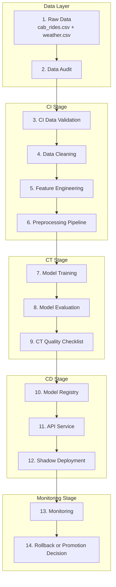

# Presentable MLOps Pipeline Diagram

Diagram ini dibuat lebih mudah dilihat di slide dibanding diagram horizontal yang terlalu panjang.

```mermaid
flowchart TB
    subgraph DataLayer["Data Layer"]
        A["1. Raw Data<br/>cab_rides.csv + weather.csv"]
        B["2. Data Audit"]
    end

    subgraph CIStage["CI Stage"]
        C["3. CI Data Validation"]
        D["4. Data Cleaning"]
        E["5. Feature Engineering"]
        F["6. Preprocessing Pipeline"]
    end

    subgraph CTStage["CT Stage"]
        G["7. Model Training"]
        H["8. Model Evaluation"]
        I["9. CT Quality Checklist"]
    end

    subgraph CDStage["CD Stage"]
        J["10. Model Registry"]
        K["11. API Service"]
        L["12. Shadow Deployment"]
    end

    subgraph MonitoringStage["Monitoring Stage"]
        M["13. Monitoring"]
        N["14. Rollback or Promotion Decision"]
    end

    A --> B --> C --> D --> E --> F --> G --> H --> I --> J --> K --> L --> M --> N
```
