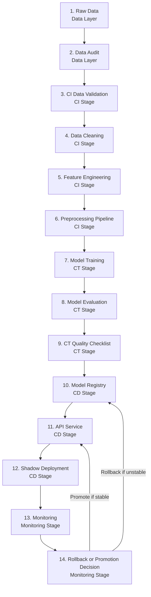

# Vertical MLOps Pipeline Diagram

Versi ini menggunakan flow vertical agar lebih cocok untuk screenshot atau slide presentasi.

```mermaid
flowchart TD
    A["1. Raw Data<br/>Data Layer"]
    B["2. Data Audit<br/>Data Layer"]
    C["3. CI Data Validation<br/>CI Stage"]
    D["4. Data Cleaning<br/>CI Stage"]
    E["5. Feature Engineering<br/>CI Stage"]
    F["6. Preprocessing Pipeline<br/>CI Stage"]
    G["7. Model Training<br/>CT Stage"]
    H["8. Model Evaluation<br/>CT Stage"]
    I["9. CT Quality Checklist<br/>CT Stage"]
    J["10. Model Registry<br/>CD Stage"]
    K["11. API Service<br/>CD Stage"]
    L["12. Shadow Deployment<br/>CD Stage"]
    M["13. Monitoring<br/>Monitoring Stage"]
    N["14. Rollback or Promotion Decision<br/>Monitoring Stage"]

    A --> B --> C --> D --> E --> F --> G --> H --> I --> J --> K --> L --> M --> N
    N -- "Promote if stable" --> K
    N -- "Rollback if unstable" --> J
```
