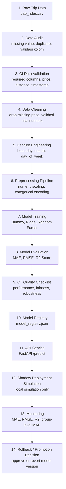

# Diagram Pipeline MLOps Vertikal

```mermaid
flowchart TD
    A["1. Raw Trip Data<br/>cab_rides.csv"]
    B["2. Data Audit<br/>missing value, duplicate, validasi kolom"]
    C["3. CI Data Validation<br/>required columns, price, distance, timestamp"]
    D["4. Data Cleaning<br/>drop missing price, validasi nilai numerik"]
    E["5. Feature Engineering<br/>hour, day, month, day_of_week"]
    F["6. Preprocessing Pipeline<br/>numeric scaling, categorical encoding"]
    G["7. Model Training<br/>Dummy, Ridge, Random Forest"]
    H["8. Model Evaluation<br/>MAE, RMSE, R2 Score"]
    I["9. CT Quality Checklist<br/>performance, fairness, robustness"]
    J["10. Model Registry<br/>model_registry.json"]
    K["11. API Service<br/>FastAPI /predict"]
    L["12. Shadow Deployment Simulation<br/>local simulation only"]
    M["13. Monitoring<br/>MAE, RMSE, R2, group-level MAE"]
    N["14. Rollback / Promotion Decision<br/>approve or revert model version"]

    A --> B --> C --> D --> E --> F --> G --> H --> I --> J --> K --> L --> M --> N
```
