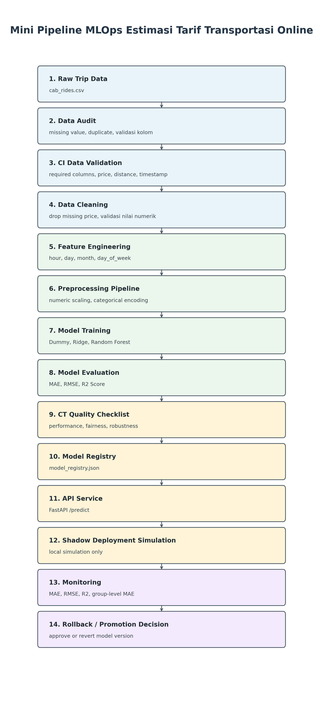

# Rancangan Mini Pipeline MLOps untuk Estimasi Tarif Transportasi Online Berdasarkan Data Perjalanan

## 1. Pendahuluan

Transportasi online menghasilkan data perjalanan yang dapat digunakan untuk memperkirakan tarif perjalanan. Kasus estimasi tarif dipilih karena sesuai dengan konteks Data Mining dan MLOps: data perlu diaudit, dibersihkan, diproses menjadi fitur model, dievaluasi, lalu disiapkan dalam skenario release sederhana.

Project ini berfokus pada estimasi tarif transportasi online berdasarkan data perjalanan. Target yang diprediksi adalah `price`, sehingga masalah ini termasuk regresi karena nilai target berbentuk numerik.

## 2. Tujuan Proyek

Tujuan project ini adalah:

- Merancang mini pipeline MLOps sederhana.
- Membuat checklist CI untuk validasi data dan pipeline.
- Membuat checklist CT untuk kualitas model.
- Membuat skenario CD untuk simulasi release model.
- Membuat diagram pipeline.
- Membuat tabel checklist kualitas.

## 3. Deskripsi Dataset

Dataset utama yang digunakan adalah `cab_rides.csv`.

Sumber dataset: https://www.kaggle.com/datasets/ravi72munde/uber-lyft-cab-prices

Data awal memiliki 693,071 baris dan 10 kolom. Target model adalah `price`.

Kolom penting yang digunakan dalam analisis:

- `distance`: jarak perjalanan.
- `cab_type`: platform atau jenis layanan transportasi.
- `source`: lokasi asal.
- `destination`: lokasi tujuan.
- `name`: nama layanan.
- `time_stamp`: waktu perjalanan dalam format timestamp.
- `price`: tarif perjalanan yang menjadi target prediksi.

Project ini hanya menggunakan data perjalanan dari `cab_rides.csv`.

## 4. Data Audit

Hasil audit awal pada `cab_rides.csv`:

| Pemeriksaan | Hasil |
|---|---:|
| Missing `price` | 55,095 rows |
| Valid price rows | 637,976 rows |
| `distance <= 0` | 0 rows |
| `price <= 0` among non-missing price | 0 rows |
| Missing `source` | 0 rows |
| Missing `destination` | 0 rows |
| Missing `cab_type` | 0 rows |
| Missing `name` | 0 rows |
| Exact duplicate rows | 0 |

Baris dengan `price` kosong harus dihapus sebelum training karena `price` adalah target supervised learning. Jika target kosong tetap digunakan, model tidak memiliki nilai aktual untuk belajar maupun mengevaluasi error prediksi.

## 5. Preprocessing dan Feature Engineering

Tahap preprocessing dilakukan dengan langkah berikut:

- Menghapus baris dengan `price` kosong.
- Memastikan `distance` bernilai lebih besar dari 0.
- Memastikan `price` bernilai lebih besar dari 0 pada data training.
- Membuat fitur waktu dari `time_stamp`, yaitu `hour`, `day`, `month`, dan `day_of_week`.
- Menentukan fitur numerik dan fitur kategorikal.
- Menggunakan preprocessing pipeline agar transformasi training dan prediction konsisten.

Fitur yang digunakan model:

- `distance`
- `cab_type`
- `source`
- `destination`
- `name`
- `hour`
- `day`
- `month`
- `day_of_week`

Kolom yang dikeluarkan:

- `id`
- `product_id`
- `price`
- `surge_multiplier`

`id` dan `product_id` dikeluarkan karena berperan sebagai identifier. `price` dikeluarkan dari fitur karena merupakan target. `surge_multiplier` tidak digunakan karena terlalu dekat dengan mekanisme pembentukan tarif.

## 6. Pemilihan dan Pelatihan Model

Beberapa baseline model dibandingkan untuk melihat performa awal:

- Dummy Regressor
- Ridge Regression
- Random Forest Regressor

Dummy Regressor digunakan sebagai baseline paling sederhana. Ridge Regression digunakan sebagai baseline linear. Random Forest Regressor digunakan karena dapat menangkap pola non-linear dan interaksi antar fitur kategorikal serta numerik.

Random Forest Regressor dipilih sebagai model terbaik karena menghasilkan MAE dan RMSE paling rendah serta R2 Score paling tinggi dibanding model baseline lain.

## 7. Hasil Evaluasi Model

| Model | MAE | RMSE | R2 Score |
|---|---:|---:|---:|
| Random Forest Regressor | 1.4254 | 2.6181 | 0.9214 |
| Ridge Regression | 1.9282 | 3.0378 | 0.8941 |
| Dummy Regressor | 7.5598 | 9.3370 | -0.0000 |

MAE menunjukkan rata-rata error absolut antara prediksi dan nilai aktual. RMSE memberi penalti lebih besar pada error yang besar. R2 Score menunjukkan seberapa besar variasi target yang dapat dijelaskan oleh model.

Berdasarkan tabel evaluasi, Random Forest Regressor menjadi baseline model terkuat.

## 8. Analisis Error

Analisis error dilakukan untuk melihat apakah performa model stabil pada beberapa grup perjalanan.

| Distance Group | Row Count | MAE | RMSE |
|---|---:|---:|---:|
| long trip | 42,101 | 1.8285 | 3.3426 |
| medium trip | 42,552 | 1.4846 | 2.5109 |
| short trip | 42,943 | 0.9716 | 1.7792 |

| Cab Type | Row Count | MAE | RMSE |
|---|---:|---:|---:|
| Lyft | 61,339 | 1.6723 | 3.1935 |
| Uber | 66,257 | 1.1968 | 1.9388 |

Service `Lux Black XL` memiliki reviewed service-name error tertinggi dengan MAE 2.9136. Temuan ini menjadi titik monitoring pada CT karena error pada service tertentu dapat menunjukkan bahwa model belum sama stabilnya untuk semua jenis layanan.

## 9. Checklist CI

| CI Check | Purpose | Status | Explanation |
|---|---|---|---|
| Required columns exist | Memastikan kolom utama tersedia sebelum preprocessing | PASS | Kolom `price`, `distance`, `cab_type`, `source`, `destination`, `name`, dan `time_stamp` tersedia. |
| Target price not missing after cleaning | Memastikan data training memiliki target | PASS | Missing `price` dihapus sebelum model dilatih. |
| `distance > 0` | Memastikan jarak perjalanan valid | PASS | Tidak ada baris dengan `distance <= 0`. |
| `price > 0` | Memastikan tarif training valid | PASS | Tidak ada `price <= 0` pada baris non-missing. |
| `source`, `destination`, `cab_type`, and `name` not missing | Memastikan fitur kategorikal utama lengkap | PASS | Keempat kolom tidak memiliki missing value. |
| `time_stamp` can be converted to datetime | Memastikan fitur waktu dapat dibuat | PASS | Timestamp dapat dikonversi menjadi `hour`, `day`, `month`, dan `day_of_week`. |
| No exact duplicate rows | Mencegah duplikasi data persis | PASS | Exact duplicate rows berjumlah 0. |
| Training pipeline can run | Memastikan preprocessing dan model dapat dieksekusi | PASS | Pipeline berhasil digunakan pada notebook training. |
| Model artifact can be saved | Memastikan model dapat disimpan untuk skenario CD | PASS | Model disimpan sebagai `models/baseline_price_model.joblib`. |

## 10. Checklist CT

| CT Check | Metric / Rule | Status | Explanation |
|---|---|---|---|
| MAE threshold | MAE <= 2.00 | PASS | MAE model terbaik adalah 1.4254. |
| RMSE threshold | RMSE <= 3.50 | PASS | RMSE model terbaik adalah 2.6181. |
| R2 threshold | R2 Score >= 0.85 | PASS | R2 Score model terbaik adalah 0.9214. |
| Error by distance group | Error short, medium, dan long trip direview | PASS | Long trip memiliki error tertinggi namun masih menjadi catatan monitoring. |
| Error by `cab_type` | Error Lyft dan Uber direview | PASS | Lyft memiliki MAE lebih tinggi daripada Uber. |
| Error by service name | Service-name error direview | WARNING | `Lux Black XL` memiliki MAE 2.9136. |
| Robustness check for trip distance | Short, medium, dan long trips dibandingkan | PASS | Model lebih akurat pada short trip dan tetap dipantau pada long trip. |
| Monitoring warning for Lux Black XL | Service dengan error tertinggi harus dipantau | WARNING | Perlu dimonitor dalam skenario Shadow Deployment Simulation. |

## 11. Skenario CD

Skenario CD pada project ini adalah simulasi lokal, bukan deployment cloud sungguhan.

Komponen CD:

- Model format: `.joblib`
- Model registry: `models/model_registry.json`
- API framework: FastAPI
- Endpoint: `/predict`
- Deployment strategy: Shadow Deployment Simulation
- Rollback: kembali ke previous approved model version
- Monitoring: MAE, RMSE, R2 Score, dan group-level MAE

Input API:

- `distance`
- `cab_type`
- `source`
- `destination`
- `name`
- `time_stamp`

API hanya digunakan sebagai simulasi lokal. Shadow Deployment Simulation berarti model dapat dijalankan dalam mode simulasi untuk membandingkan prediksi dan memonitor metrik sebelum model dianggap layak dipromosikan. Jika metrik tidak stabil, rollback dilakukan ke model approved sebelumnya.

## 12. Diagram Pipeline

## 13. Pembagian Peran Anggota

| Anggota | Peran | Tanggung Jawab |
|---|---|---|
| Anggota 1 | Data Understanding | Audit dataset dan menjelaskan kasus |
| Anggota 2 | Preprocessing | Cleaning dan feature engineering |
| Anggota 3 | Modeling | Training dan evaluasi model |
| Anggota 4 | CI/CT Checklist | Menyusun checklist kualitas |
| Anggota 5 | CD Scenario | Model registry, API plan, deployment strategy, diagram |

## 14. Batasan Proyek

- Project ini adalah simulasi pembelajaran.
- Model bukan sistem pricing produksi nyata.
- Tidak ada deployment cloud sungguhan.
- Model hanya menggunakan data perjalanan.
- Dataset bersifat historis dan bukan data real-time.

## 15. Kesimpulan

Mini pipeline MLOps untuk estimasi tarif transportasi online telah dirancang dari tahap data audit sampai skenario CD. Komponen CI, CT, dan CD sudah dimasukkan dalam alur project.

Random Forest Regressor menghasilkan baseline yang kuat dengan MAE 1.4254, RMSE 2.6181, dan R2 Score 0.9214. Project ini memenuhi output assignment berupa satu diagram pipeline dan satu tabel checklist kualitas yang terintegrasi di laporan akhir.
