# MLOps Pipeline Design

## 1. Project Title

Mini MLOps Pipeline Design for Online Transportation Fare Estimation Based on Trip and Weather Data

## 2. Short Project Description

This project designs a mini MLOps pipeline for a learning simulation that estimates online transportation fare from trip data. The project uses simple, explainable stages so undergraduate students can present the workflow clearly.

## 3. Case and Model Selected

The selected case is fare estimation for online transportation trips. The selected model is the baseline Random Forest Regressor saved as `models/baseline_price_model.joblib`.

## 4. Dataset Used

- Raw trip data: `data/raw/cab_rides.csv`
- Raw weather data: `data/raw/weather.csv`
- Cleaned training data: `data/processed/cleaned_cab_rides.csv`

Weather data is not merged yet because time and location alignment must be planned carefully.

## 5. Target and Problem Type

- Target column: `price`
- Problem type: regression

## 6. CI Stage Explanation

The CI stage validates the data before training. It checks required columns, missing target values, positive distance, positive price, missing categorical values, valid timestamps, and duplicate rows.

## 7. CT Stage Explanation

The CT stage evaluates whether the trained model is accurate and stable. It monitors MAE, RMSE, R2 Score, and group-level MAE by distance group, cab type, and service name.

## 8. CD Stage Explanation

The CD stage prepares the model for a release simulation. In this project, CD creates a model registry, API skeleton, and shadow deployment plan. It does not deploy to cloud services.

## 9. Model Registry Explanation

The model registry is saved as `models/model_registry.json`. It tracks model version, model file path, metrics, CI/CT status, approval status, and warning notes.

## 10. API Plan Explanation

The API plan uses FastAPI locally. The API receives trip input fields and returns an estimated fare. The endpoint does not require `price` and does not use `surge_multiplier` for the main baseline.

## 11. Shadow Deployment Explanation

Shadow Deployment lets the model make predictions in the background first. This is safer because errors can be monitored before the model is promoted to active simulation.

## 12. Monitoring and Rollback Explanation

Monitoring should track MAE, RMSE, R2, group-level MAE, prediction inputs, prediction outputs, timestamp, and model version. If monitoring is unstable, the simulation should rollback to the previous approved model version.

## 13. Final Pipeline Diagram in Mermaid Format

```mermaid
flowchart LR
    subgraph DataLayer["Data Layer"]
        A["Raw Data<br/>cab_rides.csv + weather.csv"]
        B["Data Audit"]
    end

    subgraph CIStage["CI Stage"]
        C["CI Data Validation"]
        D["Data Cleaning"]
        E["Feature Engineering"]
        F["Preprocessing Pipeline"]
    end

    subgraph CTStage["CT Stage"]
        G["Model Training"]
        H["Model Evaluation"]
        I["CT Quality Checklist"]
    end

    subgraph CDStage["CD Stage"]
        J["Model Registry"]
        K["API Service"]
        L["Shadow Deployment"]
    end

    subgraph MonitoringStage["Monitoring Stage"]
        M["Monitoring"]
        N["Rollback or Promotion Decision"]
    end

    A --> B --> C --> D --> E --> F --> G --> H --> I --> J --> K --> L --> M --> N
    N -- "Promote if stable" --> K
    N -- "Rollback if unstable" --> J
```

## 14. Notes for Presentation

- Explain that this is a learning simulation, not a real pricing system.
- Explain CI as data and preprocessing safety checks.
- Explain CT as model quality and stability checks.
- Explain CD as a local release design using registry, API plan, and shadow deployment.
- Mention that weather data is reserved for future improvement.
